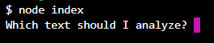
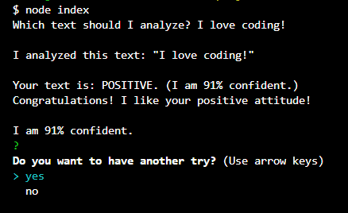

# sentiment-analysis

Node.js sentiment analysis program that will analyze text that you give in and determine the “mood” of the text. 
Used API from: https://apidemo.theysay.io/


## how to run - git clone

### clone from github:

` $ git clone https://github.com/kunstloch/sentiment-analysis.git `

### install:

```
$ cd sentiment-analysis
$ yarn 
```

### and use:

`$ node index `

Output: 



Then: 


